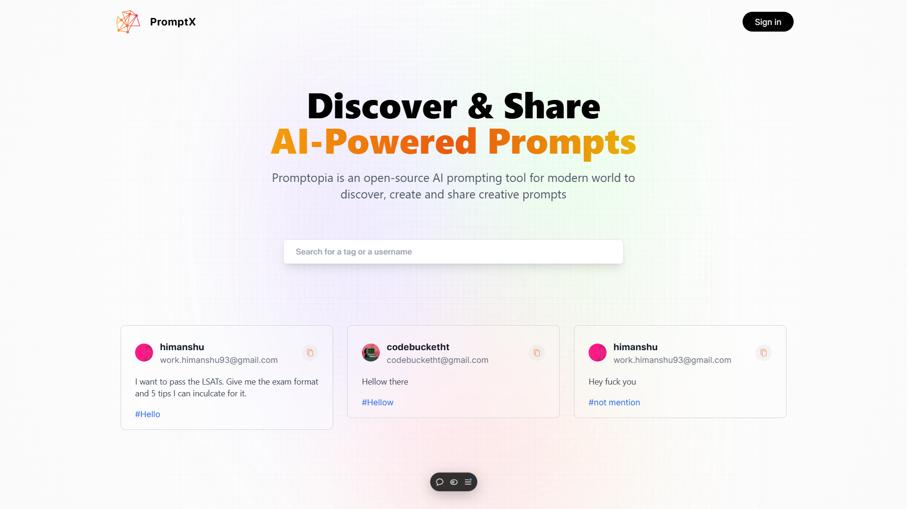

 
 
 # 🌟 PromptX

<div>
<b>PromptX</b> is a cutting-edge open-source platform 🌐 designed to empower users to discover, share, and utilize AI-powered prompts 🤖 effortlessly. With its intuitive and user-friendly interface, PromptX allows for seamless prompt creation and sharing. The platform is fully responsive and offers cross-browser compatibility, ensuring a smooth experience across all modern browsers.
</div>

## ✨ Features

- **Discover Prompts**: Explore a wide range of creative and useful AI-powered prompts shared by the community. 🔍
- **Share Your Prompts**: Easily upload and share your prompts to help others find solutions and generate ideas. ✍️
- **Copy with One Click**: Instantly copy prompts using the dedicated copy button. 📋
- **Search Functionality**: Use the advanced search bar to find prompts by tags or usernames. 🔎
- **Fully Responsive**: Enjoy a seamless experience on all devices, from desktops to tablets and smartphones. 📱💻
- **Cross-Browser Compatibility**: Works flawlessly on all major browsers like Chrome, Firefox, Safari, and Edge. 🌍

## 🚀 Installation

Set up the platform locally by following these steps:

### Prerequisites

- Node.js (v14 or higher)
- Git


### Steps

1. **Clone the Repository**:
   ```bash
   git clone https://github.com/himanshu-tyd/prompt-x
   ```

2. **Navigate to the Project Directory**:
   ```bash
   cd promptx
   ```

3. **Install Dependencies**:
   ```bash
   npm install
   ```

4. **Set Up Environment Variables**:
   Create a new file named `.env` in the root of your project and add the following lines:
   ```makefile
   GOOGLE_ID=your_google_id
   GOOGLE_SECRET=your_google_secret
   MONGODB_URI=your_mongodb_uri
   NEXTAUTH_URL=http://localhost:3000
   NEXTAUTH_URL_INTERNET=http://localhost:3000
   NEXTAUTH_SECRET=your_nextauth_secret
   ```
   🔄 Replace the placeholders with your actual values. 📂 Make sure to add the `.env` file to your `.gitignore` file so that it's not committed to your version control system. 🛠️ Use a library like `dotenv` to load the environment variables in your Next.js application.

5. **Start the Development Server**:
   ```bash
   npm start
   ```

6. **Access the Application**:
   Open your browser and navigate to `http://localhost:3000`.

## 💻 Usage

- **Sign In/Sign Up**:
  Click on the "Sign In" button to log in or register. 🔑

- **Discover Prompts**:
  Browse the home page for the latest shared prompts. 🌟

- **Search for Prompts**:
  Use the search bar to find prompts by tags or usernames. 🔍

- **Share Prompts**:
  Log in to your account to share your own prompts. ✍️

- **Copy Prompts**:
  Click the copy button to instantly save a prompt to your clipboard. 📋

## 🛠 Technologies Used

**Frontend**:
- React.js (UI Framework)
- Tailwind CSS (Styling)

**Backend**:
- Node.js
- Express.js

**Database**:
- MongoDB

**Authentication**:
- NextAuth.js

## 🤝 Contributing

We welcome contributions from the community! Follow these steps to contribute:

1. **Fork the repository**.
2. **Create a new branch for your feature/bug fix**:
   ```bash
   git checkout -b feature-name
   ```
3. **Commit your changes**:
   ```bash
   git commit -m "Add feature description"
   ```
4. **Push to your fork**:
   ```bash
   git push origin feature-name
   ```
5. **Submit a pull request**.

## 📜 License

This project is licensed under the MIT License.


## 💬 Feedback

If you have any feedback or suggestions, feel free to open an issue or reach out to us:

- **Email**: code.himanshu93@gmail.com
- **GitHub**: [@himanshu-tyd](https://github.com/himanshu-tyd)

## 😊 Happy Coding

We hope you enjoy using PromptX! We're always open to feedback and suggestions. If you have any, feel free to open an issue or reach out to us. 😊

